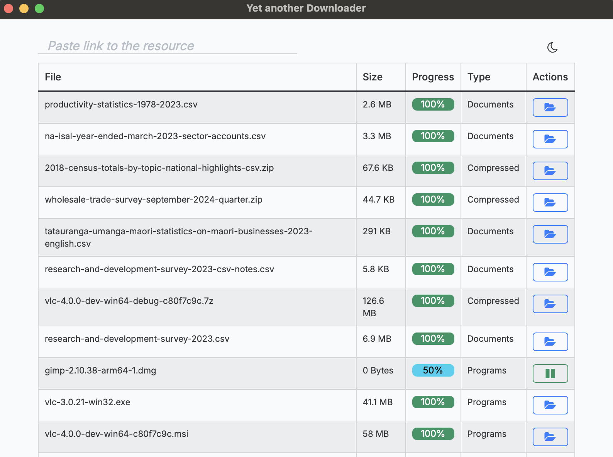
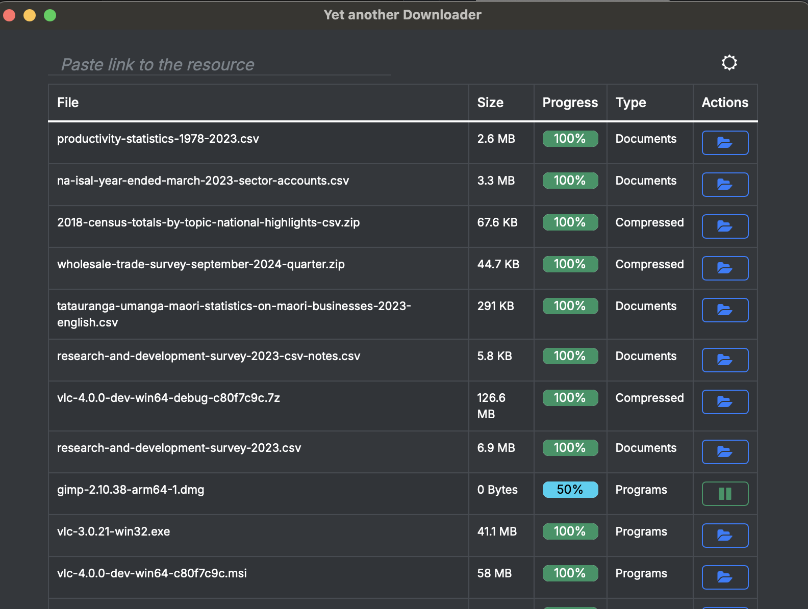

# Yet Another Downloader

<p align="center">
  <a href="https://skillicons.dev">
    
  </a>
</p>

---


---

Yet Another Downloader is a download manager. The downloaded files are organised by type inside a
directory called `Yad` inside your default download directory.

In order to download a file, paste it's url in the text box and the download will automatically
start.

On the right side of the text input is an icon to change the theme between light and dark.

Once a file is downloaded, you will see a folder icon to the right side of the table to open the
file.

**This is a beta version, please report bugs as issues: **

This software is released under the [Apache V2 license](https://choosealicense.com/licenses/apache-2.0/). Please read both the [License](./LICENSE) and [Notice](./NOTICE)


## Installation

This project is built with [Rust](https://www.rust-lang.org/) and [Tauri](https://tauri.app/), It also requires [Node](https://nodejs.org) to be installed. Therefore make sure they're installed firts.

```sh
# install rust 
curl --proto '=https' --tlsv1.2 -sSf https://sh.rustup.rs | sh

# install tauri-cli
cargo install tauri-cli 

# build
# the binary will be inside src-tauri/target/release/
cargo tauri build --no-bundle --config src-tauri/tauri.conf.json

```

Once done, double click on the binary to open. Below are sample screenshots.




---


## Contributing

Please the following guidelines on contributing.

- [Reporting Bugs](./.github/ISSUE_TEMPLATE/bug_report.md)
- [Requesting Features](./.github/ISSUE_TEMPLATE/feature_request.md)
- [How to contribute](./.github/CONTRIBUTING.md)
- [How to make a pull request](./.github/pull_request_template.md)

---

You can read about how I made this and more at [innv8.ke](https://innv8.ke). This is my educational
Github Organisation. Please also check my [personal GitHub](https://github.com/rapando)


> rapando
